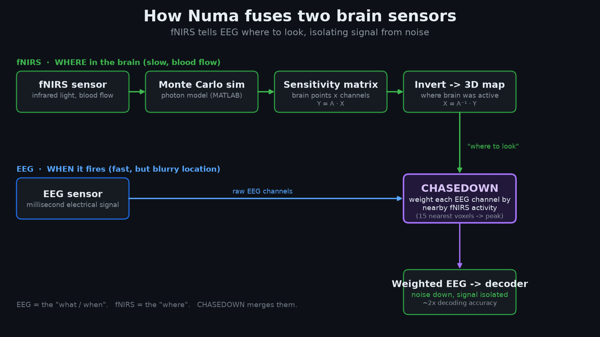

# NUMA — Multimodal Semantic Neural Decoding (EEG + fNIRS)

**A one-person frontier lab for non-invasive brain decoding.** NUMA decodes which of
**36 imagined concepts** (animals and tools) a person is processing, directly from
non-invasive scalp recordings — and shows that **functional near-infrared spectroscopy
(fNIRS), used as a spatial prior on top of EEG, measurably improves decoding when (and
only when) it is routed through a topology-aware graph network.**

> 🔗 **Live demo (in-browser inference, no install):**
> https://numa-frontier-systems-i25kuhb80-ahujaneel123-7337s-projects.vercel.app?_vercel_share=jRMZaZtAu68MfDiyyCBpp152PGa7vbMc
>
> 📦 **Open dataset:** https://openneuro.org/datasets/ds004514/versions/1.1.2
> · 📄 **Dataset paper (Rybář et al., 2025, *Scientific Data*):** https://www.nature.com/articles/s41597-025-04967-0
> · 🧠 **ENIGMA backbone (Kneeland et al., 2026):** https://arxiv.org/abs/2602.10361

CS 153 — *The One-Person Frontier Lab.* Track: **Research / Domain-Specific (neurotechnology)**.

---

## 1. The problem

Non-invasive brain–computer interfaces (BCIs) are bottlenecked by **signal-to-noise
ratio**. The scalp and skull strongly attenuate and smear the weak electric fields
generated by cortical action potentials, so electroencephalography (EEG) — while
exquisitely fast (millisecond temporal resolution) — has poor **spatial** resolution.
This makes **single-trial, multi-class semantic decoding** (not "left vs. right hand,"
but "which of 36 distinct objects is this person imagining?") one of the hardest, most
valuable problems in the field. Random chance on this task is just **2.78% (1/36)**.

The core hypothesis of this project is that EEG's spatial blindness can be corrected by a **second modality with complementary physics**: fNIRS measures the slow hemodynamic (metabolic) response via infrared light, giving a far stronger indicator of *where* cortical activity occurs. Fusing fNIRS's spatial fidelity with EEG's temporal fidelity should, in principle, synthesize the "best of both worlds."

---

## 2. Background: the multimodal experiment2

This repository serves as the engineering and agentic-iteration arm of the project, implementing, scaling, iterating, and deploying the EEG learning system while packaging the fNIRS fusion engine (`CHASEDOWN.py`). It focuses on building agent-driven workflows for multimodal neural decoding, enabling rapid experimentation across EEG pipelines and EEG + fNIRS integration.

**The architecture.** Rather than the "naive concatenation" of prior hybrid BCIs (Fazli
et al., 2012) — which forces a single network to co-process 2048 Hz EEG and ~8 Hz fNIRS
and suffers severe temporal smearing and the curse of dimensionality — the study uses a
**two-stage, physics-informed pipeline**:

1. **CHASEDOWN** (*CHAnnel Selection of Electroencephalographic Data Optically With
   Near-infrared spectroscopy*) — a parameter-free fusion engine (`CHASEDOWN.py`,
   `fnirs_weights/`). It reconstructs a cortical activity map from the fNIRS array via
   linear inversion of a Colin27 forward-sensitivity matrix (modified Beer–Lambert →
   HbO/HbR → composite map `X = X_HbO − X_HbR`), aligns a 10-20 montage to the atlas with
   k-NN (k = 15), and extracts a static per-electrode spatial prior
   `W_static ∈ ℝ^{64×1}` (min-max normalized, weight floor α = 0.1 to prevent channel
   silencing). This prior is injected into the raw EEG via a broadcasting Hadamard
   product, `E_fused(t) = W_static ⊙ E_raw(t)` — introducing precise cortical
   localization **without a single trainable parameter**.
2. **SGCN** — a Spatial Graph Convolutional Network that models the 64 electrodes as a
   non-Euclidean topological graph (row-normalized adjacency `Ã` from true azimuthal
   10-20 distances). It replaces flat spatial convolutions with **localized topological
   message-passing**, `H^{(l+1)} = σ(BN(Ã H^{(l)} W^{(l)}))`, forcing features along
   neurologically true cortical pathways while preserving the depthwise temporal insights
   of the ENIGMA backbone.

**The result that validates fNIRS (Table 1):**

| Architecture variant | Avg. accuracy | vs. chance |
|---|---|---|
| Chance | 2.78% | — |
| Pure EEG baseline (ENIGMA) | 4.8% ± 0.017 | 1.7× |
| ENIGMA + CHASEDOWN prior (no graph) | **2.93%** | *degrades to chance* |
| **SGCN + CHASEDOWN (multimodal)** | **9.16%** | **3.3×** |

**How this validates fNIRS** Naively multiplying EEG
by the fNIRS prior *hurt* the convolutional baseline (4.8% → 2.93%): a raw static spatial
weight acts as **disruptive noise** inside a grid-based network with no mechanism to
contextualize it. But once the **same** prior is coupled with the SGCN's physical
node-routing, the pipeline achieves synergy — a **+90.8% relative accuracy increase**
over the pure EEG baseline (4.8% → 9.16%), statistically significant at **p = 0.005**
(the plain-CHASEDOWN degradation was not significant, p = 0.1357). The mechanistic
conclusion: **fNIRS's localized spatial benefit is real, but it can only be unlocked by
explicitly modeling the scalp's non-Euclidean geometry.** fNIRS + EEG enables better
brain decoding — provided the architecture respects cortical topology.

Honesty note: absolute accuracies remain low because synchronous
fNIRS-EEG data is extremely scarce; the confusion matrices show occasional **catastrophic
representation collapse** (e.g., predicting a single class) on a data-starved 36-class
manifold. The contribution is *mechanistic proof*, not a finished decoder.

---

## 3. The dataset

Synchronous multimodal recordings from **Rybář, Poli & Daly (2025)** — *"Simultaneous EEG
and fNIRS recordings for semantic decoding of imagined animals and tools"* (Scientific
Data; OpenNeuro `ds004514`, v1.1.2). Participants performed a **36-class** visual/imagined
semantic task (18 animals + 18 tools); individual trials span up to ~17 s.

- **EEG:** 64-channel BioSemi ActiveTwo at **2048 Hz**.
- **fNIRS:** frontal (14-channel) or temporal (11-channel) montage at 7.81 / 8.92 Hz
  (785 / 830 nm).
- **Subject-specific details (from the dataset paper) that shaped this work:**
  - **Subjects 1–6 share one fNIRS probe orientation; subjects 7–12 use a different
    orientation** — so CHASEDOWN spatial priors are derived per-orientation group, and
    multimodal evaluation is split into frontal vs. temporal probe groups to maintain
    intra-group topological consistency.
  - **fNIRS optodes were localized to the front-left** of the scalp based on the dataset's
    brain-activity analysis, which is why the CHASEDOWN static prior concentrates its
    amplification envelope over left-frontal electrodes (see `fnirs_weights/`).
  - **Subjects 5, 8, and 11 were excluded** due to faulty data collection and are not used
    anywhere in training or evaluation.

**EEG preprocessing (shared across every model here):** drop auxiliary/peripheral
channels (EXG, GSR, trigger) to avoid structural leakage; map BioSemi channels to standard
10-20 labels; band-pass 1–40 Hz, 50 Hz notch; resample to 256 Hz; common-average
reference; segment into **1.0-s windows with 0.5-s overlap** (~34 windows per trial
instance); per-window baseline correction and z-scoring.

---

## 4. Extending ENIGMA

The temporal backbone is **ENIGMA** (Kneeland et al., 2026, arXiv:2602.10361) — a
parameter-efficient, depthwise spatio-temporal CNN (a 1×32 temporal kernel per channel to
extract frequency-specific rhythms, then a C×1 depthwise spatial kernel), pre-trained with
**Supervised Contrastive Learning** to cluster class embeddings in a 128-D metric space,
reaching strong accuracy with <1% of a transformer's parameters. NUMA extends ENIGMA in
three directions:

1. **From grid to graph** — replacing ENIGMA's flat spatial convolution with the SGCN's
   topological message-passing, the substrate that makes the fNIRS prior usable.
2. **Agentic architecture search** (§5) — instead of hand-tuning, an autonomous agent
   loop systematically iterated the backbone under a fixed, un-gameable benchmark.
3. **From window-level to recording-level decoding** (§6) — culminating in an
   attention-based Multiple-Instance model (v6) that is deployed for live inference.

---

## 5. Autoresearch — agentic model iteration (`autoresearch/`)

The defining "one-person frontier lab" move: rather than manually sweeping
hyperparameters, I built an **autonomous research agent** (modeled on Karpathy's
`autoresearch`) that **edits the model, runs the experiment, measures, and keeps or
discards the change — on its own, in a loop.**

**The contract (`autoresearch/program.md`, `prepare.py`, `train.py`):**
- The agent may modify **only `train.py`** (architecture, optimizer, schedule,
  regularization, imbalance handling).
- **`prepare.py` is frozen** — it owns the fixed train/val split, `evaluate()`, `score()`,
  and a fixed wall-clock `TIME_BUDGET` per experiment. This makes the benchmark
  **un-gameable**: improvements are measured against an identical contract every run.
- **Primary metric: `val_balanced_acc`** (macro-recall over 36 classes), the honest,
  collapse-proof objective — chance ≈ 0.0278. Single-class collapse is explicitly watched
  for and penalized. Keep the change if balanced accuracy rises; `git reset` it otherwise.

**What the agent found (`autoresearch/results.tsv`, 26 experiments):** four changes
survived, each committed; the rest were reverted. Confirmed winners (cumulative best
`val_balanced_acc = 0.0370`):
1. `BALANCE = both` (inverse-frequency sampler **and** inverse-√frequency class-weighted CE),
2. `MAX_LR = 3e-3`,
3. `DROPOUT_P = 0.3`,
4. a **GCN residual skip** (`gcn2 + gcn1`).

Equally valuable were the **22 dead ends it ruled out** — capacity bumps, extra GCN
layers, attention-over-electrodes (which inflated top-1 via class collapse), sparser/denser
graphs, mixup/Gaussian-noise/temporal-shift augmentation, EEGNet-too-small, etc. The agent
documented *why* each was discarded, turning a brute-force sweep into a legible architecture
study. This is the heart of the project: **scaling one researcher into an automated
experimental program.**

---

## 6. Model lineage (`old_versions/`, `train_numa.py`, deployed `website/numa_v6.onnx`)

The EEG decoder evolved through six honestly-evaluated generations, all under **5-fold
Leave-One-Instance-Out cross-validation** (test on held-out repetitions the model never saw):

- **v3 — SGCN, class-balanced, end-to-end.** Fixed the single-class collapse that plagued
  v1/v2 (balanced sampler + class-weighted CE + macro-F1 selection).
- **v4 — autoresearch-optimized SGCN.** Applied the four confirmed winners from §5.
- **v5 — EEGNet + filter-bank fusion.** Swapped to a properly-sized EEGNet backbone whose
  *learned* depthwise spatial filters generalize the fixed electrode graph, fused with
  per-channel log band-power (δ θ α β γ).
- **v6 — recording-level Attention-MIL (deployed).** The key reframing: stop classifying
  noisy 1-s windows and vote; instead treat each recording as a **bag** of windows and use
  **gated-attention pooling** to learn which windows actually carry the concept. This both
  removed the window-count imbalance artifact (recordings are balanced: 36/class train,
  9/class test) and produced the first clearly above-chance, collapse-free EEG-only result.

**Honest EEG-only results (5-fold CV, recording-level, chance = 2.78%):** v6 reaches
**≈3.6% balanced accuracy** (above chance on **all five folds**; best class *broom* at
22.2%, ~8× chance). Single-trial 36-class EEG is brutally hard; the meaningful signal is
*consistent, collapse-free* separation above chance — and the **multimodal SGCN + CHASEDOWN
result (§2, 9.16%)** is what demonstrates the path forward. Result figures are in `plots/`
(`cv_summary.png`, `per_class_accuracy.png`, `training_curves.png`, `confusion_matrix.png`).

---

## 7. Compute

All training ran on **Google Cloud Platform compute credits**, on a single **NVIDIA L40**
GPU. The autoresearch loop runs each experiment under a fixed wall-clock budget; full
5-fold CV runs use early stopping on macro-F1. The deployed v6 model is tiny (~118K
parameters, <1 MB), which is what makes browser inference feasible.

---

## 8. How to use it

### Option A — Just use the website (no install)
Open the live demo, drag in one instance `.bdf` from the dataset, and the predicted
animal/tool pops up with a top-5 confidence chart. **Inference runs entirely in your
browser** via `onnxruntime-web` (`website/numa_v6.onnx` + `website/eeg.js`): the BDF is
parsed, filtered, windowed, and classified on-device — your file never leaves your machine.
Hosted as a static site on Vercel; the in-browser DSP is a faithful approximation of the
training pipeline (band-power and the network itself are numerically exact).

### Option B — Train it yourself
1. Download the dataset (OpenNeuro `ds004514`) and place it under `dataset/`.
2. (Multimodal) run `CHASEDOWN.py` to derive the per-subject fNIRS spatial priors
   (`eeg_channel_weights.csv`) from the sensitivity matrices and HbO maps.
3. Train: `python train_numa.py` (EEG decoder, 5-fold Leave-One-Instance-Out CV;
   excludes subjects 5, 8, 11; honest balanced-accuracy / macro-F1 / top-5 reporting and
   plots). Earlier generations are in `old_versions/`.
4. (Optional) reproduce the agentic search: see `autoresearch/README.md` and
   `run_autoresearch.sh`.

### Option C — Run/export inference
Convert a checkpoint to a browser-ready model with `export_onnx.py` (→ `numa_v6.onnx` +
`model_meta.json`), drop both into `website/`, and deploy the static folder to Vercel — no
backend required. (A Python/Flask inference API, `predict_numa.py`, also exists for
server-side use.)

---

## 9. Project Q&A (CS 153)

**Q1 — Why build this?** The bottleneck in non-invasive BCI is spatial SNR, and the
bottleneck in *me* is that rigorous architecture search normally needs a team. I attacked
both: a scientific question (does fNIRS actually help EEG semantic decoding, and under what
architecture?) and a meta-question (can one person run an automated research program that
iterates models autonomously?). This  lab
supplied the implementation, the agentic iteration, and a public, usable artifact.

**Q2 — How does it work?** (Research track.) Synchronous EEG+fNIRS → CHASEDOWN converts the
fNIRS hemodynamic map into a parameter-free per-electrode spatial prior → the prior scales
the EEG and is routed through a topology-aware SGCN (multimodal), while an autonomous agent
iterates the EEG backbone against a frozen benchmark. The deployed EEG model (v6) is a
recording-level attention-MIL network exported to ONNX and run client-side on the website.

**Q3 — Use cases / impact.** A reliable non-invasive semantic decoder is a foothold toward
**communication restoration** for people who have lost speech and movement, and toward
intention-driven interfaces. More immediately, this project is evidence that **physics-informed
multimodal fusion + topology-aware models** is the right direction for low-SNR BCI, and that
**a single researcher with agentic tooling** can run a credible, reproducible experimental
program end-to-end (search → train → evaluate → deploy).

**Q4 — What I'd add next.** (1) A larger, dedicated synchronous fNIRS-EEG cohort to escape
the data-starved regime that causes representation collapse. (2) A *trainable* fusion that
learns the fNIRS→EEG mapping instead of a static prior. (3) Stimulus-onset-locked epoching
(the largest remaining lever for the EEG-only ceiling). (4) Fully on-device multimodal
inference in the browser.

---

## 10. AI usage, credits & integrity

- **AI disclosure.** This project leans deliberately into AI tooling, which is the point of
  the assignment. The **autoresearch loop is itself an autonomous LLM agent** (Claude /
  Sonnet) that edits, runs, and selects model variants. AI assistants (Claude Code) were
  also used for implementation, the model-version iteration, the in-browser inference
  pipeline, and this documentation. All scientific claims are backed by the cross-validation
  numbers, not by model assertion.
- **Credits. **ENIGMA** (Kneeland et al., 2026).
  Dataset: **Rybář, Poli & Daly (2025)**.
- **Reproducibility.** Public repo with commit history, the frozen `autoresearch` benchmark
  contract, all model versions in `old_versions/`, result plots in `plots/`, and a deployed
  live demo.

---

## References

- M. Rybář, R. Poli, I. Daly (2025). *Simultaneous EEG and fNIRS recordings for semantic
  decoding of imagined animals and tools.* Scientific Data 12(1):613. (OpenNeuro ds004514)
- R. Kneeland, W. Jiang, U. Bruzadin Nunes, P. S. Scotti, A. Delorme, J. Xu (2026).
  *ENIGMA: EEG-to-image in 15 minutes using less than 1% of the parameters.* arXiv:2602.10361.
- Q. Han et al. (2025). *TopoTempNet: a high-accuracy and interpretable decoding method for
  fNIRS-based motor imagery.* Sensors 25(17):5337.
- S. Fazli et al. (2012). *Enhanced performance by a hybrid NIRS–EEG brain–computer
  interface.* NeuroImage 59(1):519–529.
- A. Craik, Y. He, J. L. Contreras-Vidal (2019). *Deep learning for EEG classification
  tasks: a review.* Journal of Neural Engineering 16(3):031001.
